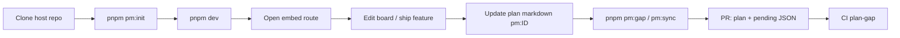

# Embedded PM strategy

Projocalypse can replace external PM tools **inside any repo** that developers clone and run locally. The host app embeds a sprint board; **plan markdown in git** stays the master backlog; **IndexedDB** holds live execution state per browser origin. Cross-developer alignment uses layered sync — git today, optional file-bridge commits, and a roadmap toward P2P without a central server.

**Related:** [MONOREPO.md](./MONOREPO.md) (CLI, registry, file bridge), [EMBED.md](./EMBED.md) (mount API, scoping), [README.md](../README.md) (standalone browser sync).

## Goals

| Goal | How |
|------|-----|
| **Spin up locally** | Submodule or workspace package + `pnpm pm:init` + host dev server + embed route |
| **Same backlog for everyone** | `doc/PLAN/**/*.md` with stable `pm:PM-###` ids in git |
| **Execute on a board** | Embedded `ProjocalypseApp` → Dexie `Project` scoped by `hostProjectId` |
| **Detect drift** | `pnpm pm:gap` compares plan vs board snapshot / pending upserts |
| **Sync without a PM SaaS** | Git + file bridge today; browser sync file for task state; P2P on roadmap |

## Two sources of truth (by design)

| Layer | Storage | Authority | Who edits |
|-------|---------|-----------|-----------|
| **Plan / backlog** | Git (`doc/PLAN/**/*.md`) | **Master** — what should exist, done vs open, section metadata | Developers + agents in PRs |
| **Board execution** | IndexedDB (`pm-tool` DB, per origin) | **Operational** — column placement, assignees, subtasks, WIP | Developers in the embed UI |

The CLI **does not** write IndexedDB. It writes files under `.projocalypse/` that the host serves statically; the browser imports pending tasks once per batch. Gap analysis compares plan checkboxes to board snapshots when available.

```
  git (plan markdown)          CLI (gap / sync)
        │                              │
        └──────────┬───────────────────┘
                   ▼
         .projocalypse/pending/*.json  ──serve──►  embed import
         .projocalypse/board/*.json    ◄──export──  (optional snapshot)
                   │
                   ▼
              IndexedDB (per origin)
              live sprint board
```

## Embedded PM for any repo

### Add Projocalypse to the host

1. **Git submodule** or **pnpm workspace** package pointing at this repo (see [MONOREPO.md](./MONOREPO.md)).
2. From host root: `pnpm install` → `pnpm exec projocalypse init` (or `pnpm pm:init` after init scaffolds scripts).
3. **`pnpm pm:init`** copies Cursor templates to `.cursor/projocalypse-host/` — merge rules, skills, and `/plan-sync` into the host `.cursor/`.
4. Register each embeddable app in **`.projocalypse/workspace.json`** (plan globs, sections, embed route, `hostEntityField`).

### Per-developer spin-up

```bash
git clone <host-repo> && cd <host-repo>
git submodule update --init --recursive   # if submodule
pnpm install
pnpm pm:init                              # once per clone (Cursor templates)
pnpm dev                                  # host app
# open embed route, e.g. /books/:id/sprint
```

Each developer gets their own IndexedDB on that origin (localhost or deployed preview). Plan items are identical because they come from git; board state diverges until sync layers propagate changes.

### Embed route (host responsibility)

Mount `ProjocalypseApp` with `packageName`, `hostProjectId`, and `pendingSyncUrl`. Serve `.projocalypse/pending/` at `/.projocalypse/pending/` in the static build. First mount without a linked project runs the **host setup wizard** (create project → import pending). Details: [EMBED.md](./EMBED.md), [MONOREPO.md](./MONOREPO.md).

---

## Cross-developer sync layers

Sync is **layered**. Use the lowest layer that meets your team; add layers only when git + file bridge are insufficient.

### Today (shipped)

| Layer | Mechanism | What syncs | Scope |
|-------|-----------|------------|--------|
| **Git plan** | PRs merge `doc/PLAN/**` | Backlog items, checkboxes, `pm:section` metadata | Whole team via git remote |
| **CLI file bridge** | `pnpm pm:sync` → `.projocalypse/pending/` | New/updated tasks derived from plan gap | Files on disk; browser imports on embed load |
| **CLI gap** | `pnpm pm:gap` | Detects `MISSING_ON_BOARD`, `STATUS_MISMATCH`, etc. | CI + local; read-only |
| **Browser sync file** | Settings → link `projocalypse-sync.json` (File System Access API) | Projects, tasks, developers, tombstones | Per **origin** — shared folder (iCloud/Dropbox/Drive) |
| **Tab mirror** | `localStorage` `projocalypseSyncMirror` | Same slice as sync file | All tabs on one origin |

**Important:** Browser sync is **origin-global** today (one linked file per site origin). Embedded hosts should decide whether each developer links one file for all host projects or uses project-scoped export/import instead. See [EMBED.md](./EMBED.md) settings table.

**Git is source of truth for the backlog.** IndexedDB is source of truth for **live board edits** until exported or synced.

### Near-term (recommended practice, not all automated yet)

| Practice | Purpose |
|----------|---------|
| **Commit `.projocalypse/pending/*.json`** | Reviewers see upserts in PR diffs; CI/preview serves static pending for embed import |
| **Optional `.projocalypse/board/*.json` in git** | Team-visible snapshots for gap `STATUS_MISMATCH` / `SECTION_DRIFT` without opening each dev's browser |
| **`.projocalypse/links/<slug>.json`** | Stable `packageName` → `hostProjectId` mapping across clones |
| **Plan-gap CI** | `pnpm pm:gap --fail-on MISSING_ON_BOARD,STATUS_MISMATCH` on plan or `.projocalypse/` changes |

Workflow after plan edits: `pnpm pm:plan` → `pnpm pm:gap` → `pnpm pm:sync` → commit pending if changed → reload embed. Use **`projocalypse-plan-sync`** skill or `/plan-sync` in Cursor.

### Roadmap (not implemented unless noted in ROADMAP)

These are **forward-looking options** — honest recommendations, not shipped features:

| Option | Role | Notes |
|--------|------|-------|
| **CRDT over sync file** | Merge concurrent board edits in the shared JSON file | Extends today's File System Access sync with conflict-free merges (e.g. Yjs persistence adapter writing the same `projocalypse-sync.json` shape) |
| **WebRTC data channel P2P** | Direct browser-to-browser board updates | e.g. Yjs + `y-webrtc` or simple peer mesh; no central DB; needs signaling |
| **Optional relay** | NAT traversal / offline peers | Lightweight WebSocket signaling + optional TURN; relay is **not** source of truth, only connects peers |
| **IPFS / static hosting of pending** | Distribute pending upserts without git commit | Read-only pull of `.projocalypse/pending/` hashes; git remains plan authority |
| **GitHub Actions as notifier** | Ping developers to run `pm:sync` or reload embed | Workflow posts PR comment or dispatches webhook — **not** a write path into IndexedDB |

Priority order for implementation: **team-visible git artifacts (pending/board)** → **CRDT-enhanced sync file** → **P2P with optional relay**. See [PLAN/ROADMAP.md](./PLAN/ROADMAP.md) for tracked `pm:ID` items.

---

## Developer workflow (end-to-end)



1. **Clone** host monorepo (with submodule if used).
2. **`pnpm pm:init`** — merge Cursor host templates once.
3. **`pnpm dev`** — run host app; open package embed route from `workspace.json`.
4. **Bootstrap** — first visit creates/links `hostProjectId`; import pending tasks from served JSON.
5. **Daily work** — move tasks, assign, complete subtasks in embed (IndexedDB).
6. **Ship feature** — mark plan checkbox `[x]`, set `pm:section=Done`, run gap, commit plan + optional pending/board files.
7. **CI** — `plan-gap` workflow fails on blocking drift; agents use plan-sync skill on plan PRs.

Standalone Projocalypse users follow the same plan-sync pattern when this repo dogfoods its own `doc/PLAN/ROADMAP.md`.

---

## Security and privacy

| Topic | Behavior |
|-------|----------|
| **IndexedDB isolation** | Data is per **browser origin**; embedded `hostProjectId` scopes project export |
| **No forced cloud** | No Projocalypse account or server; sync file linking is opt-in |
| **Host-scoped backup** | Embedded hosts should use `exportProjectData(hostProjectId)`, not full-DB export, on shared origins |
| **Git visibility** | Plan and committed `.projocalypse/` files are visible to anyone with repo access — do not put secrets in plan titles or task descriptions |
| **P2P (roadmap)** | Peers expose only project-scoped sync payloads; use encrypted channels if relay is untrusted |

---

## When to use which doc

| Question | Read |
|----------|------|
| How do I mount the React embed? | [EMBED.md](./EMBED.md) |
| How do I wire CLI, registry, and file bridge? | [MONOREPO.md](./MONOREPO.md) |
| What is the team sync strategy over time? | **This doc** |
| What is on the implementation backlog? | [PLAN/ROADMAP.md](./PLAN/ROADMAP.md) |
